**Intervalo 10**

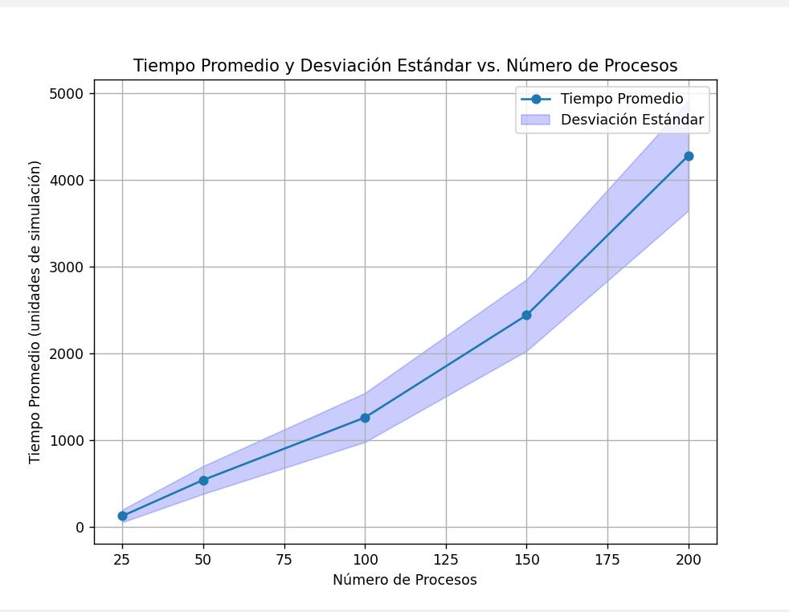

**Intervalo 5**

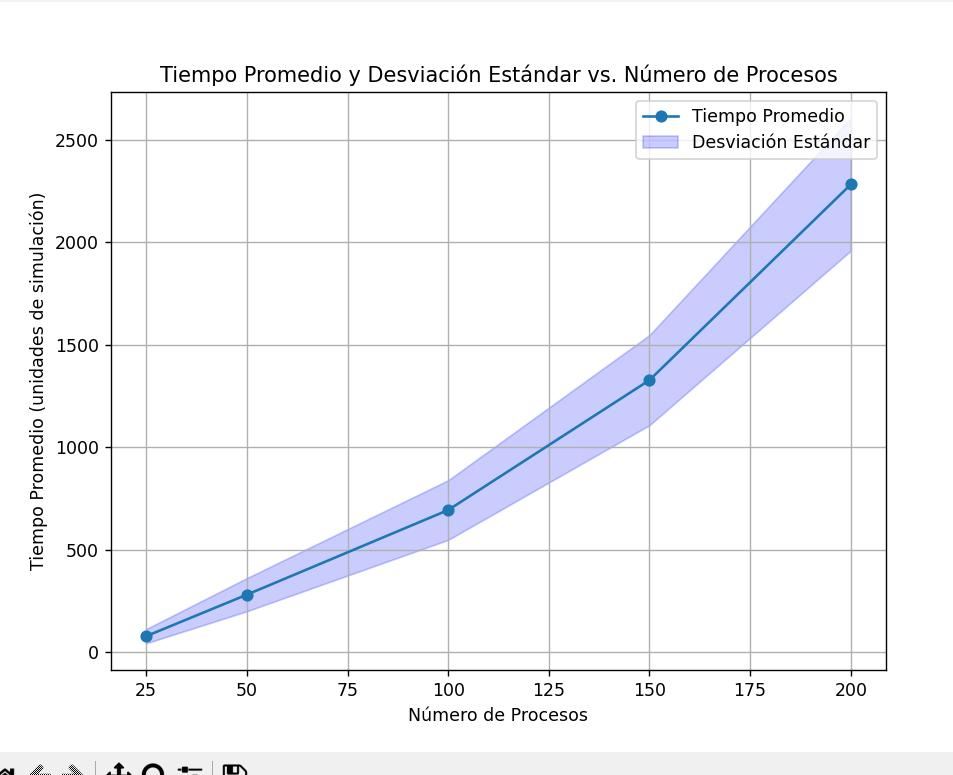

**Intervalo 1**

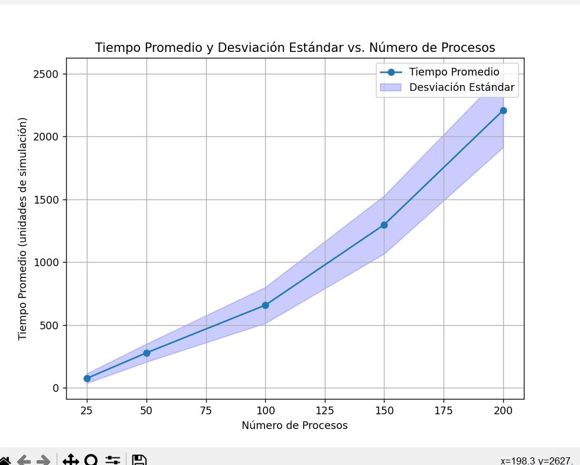

**Memoria 200 intervalo 1**

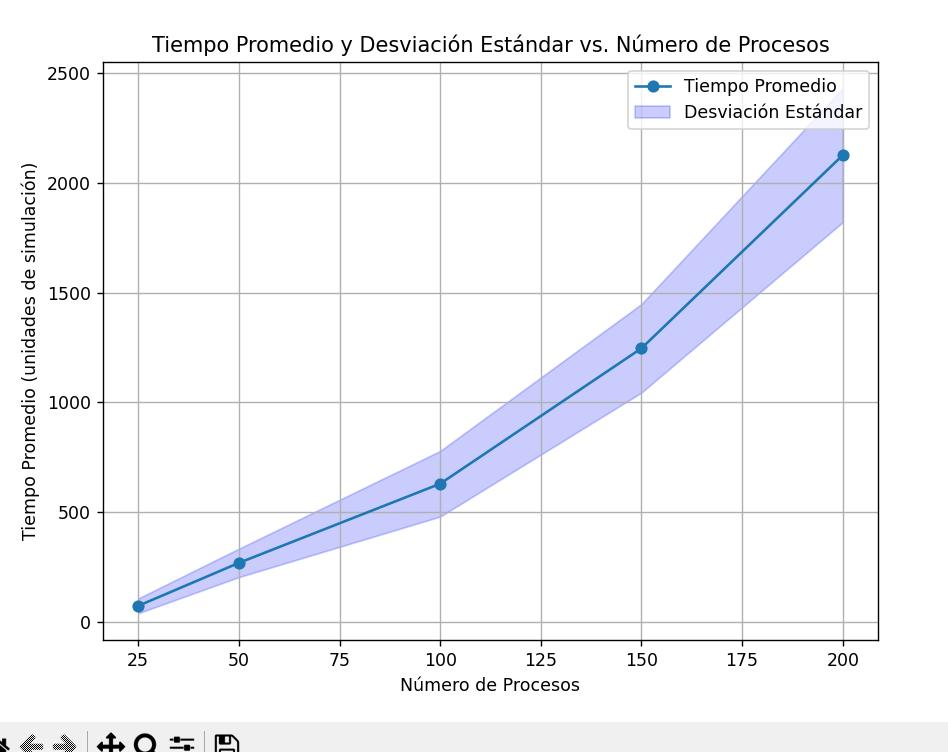

**6 instrucciones por unidad de tiempo intervalo 1**

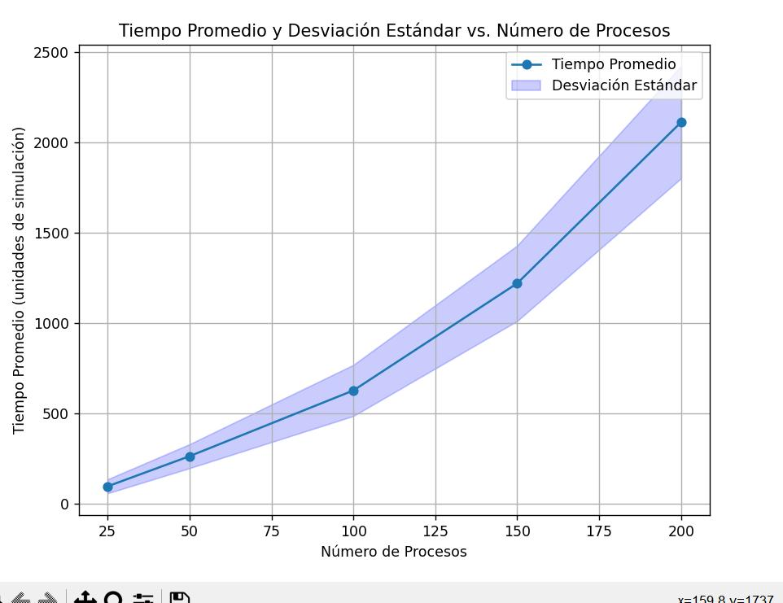

**2 hilos interval 1**

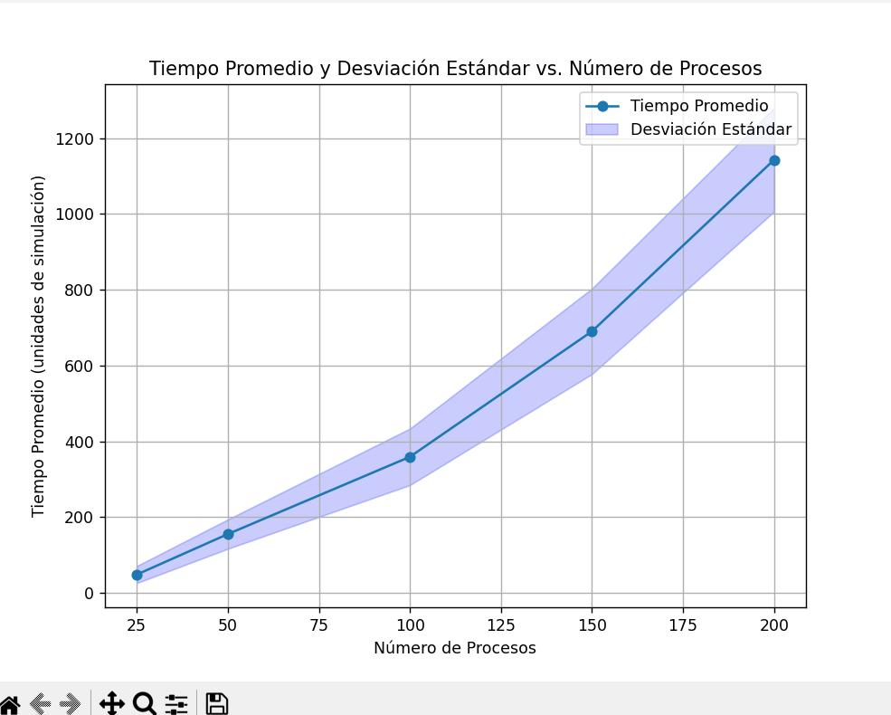

**Memoria 200 intervalo 5**

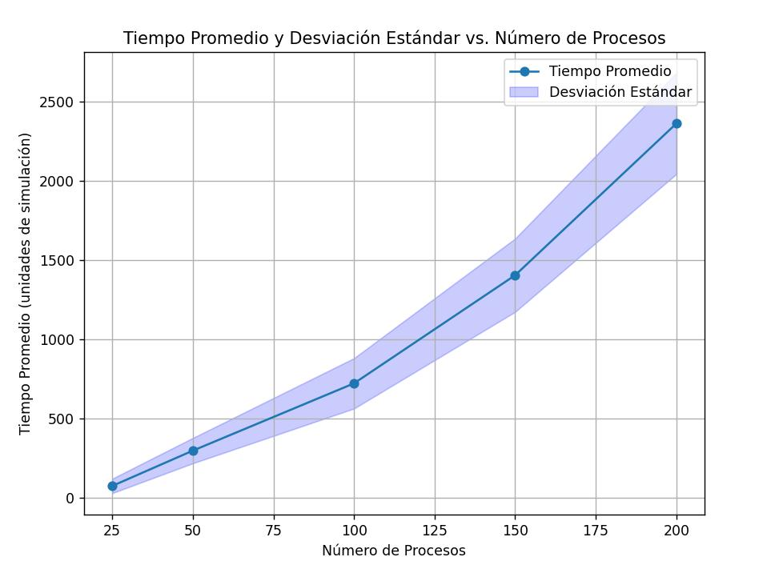

**6 instrucciones por unidad de tiempo intervalo 5**

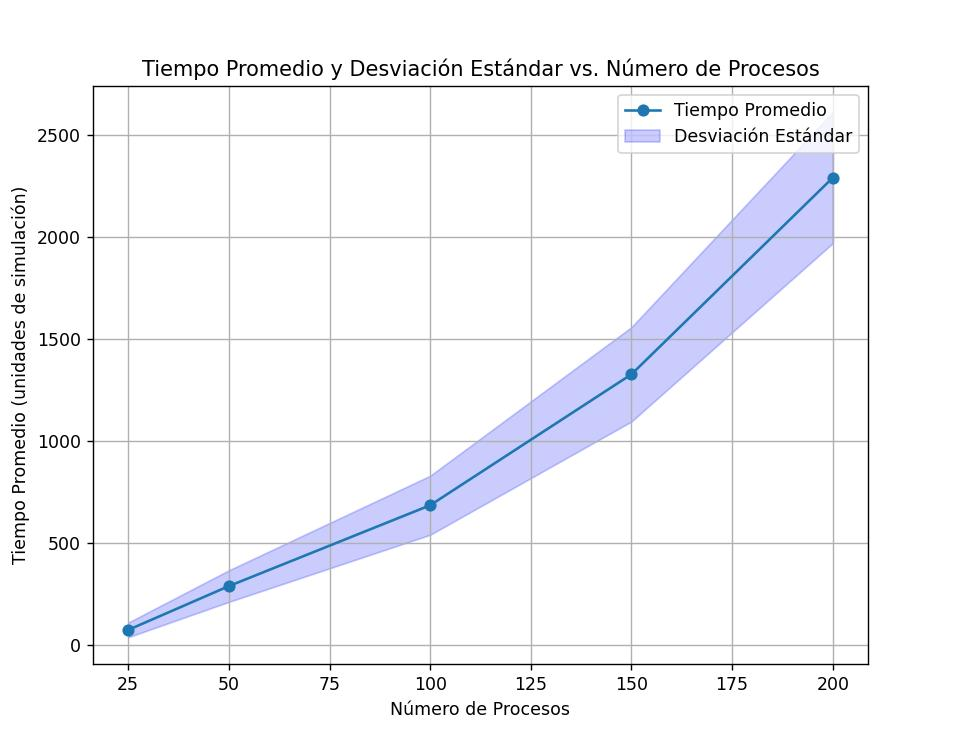

**2 hilos intervalo 5**

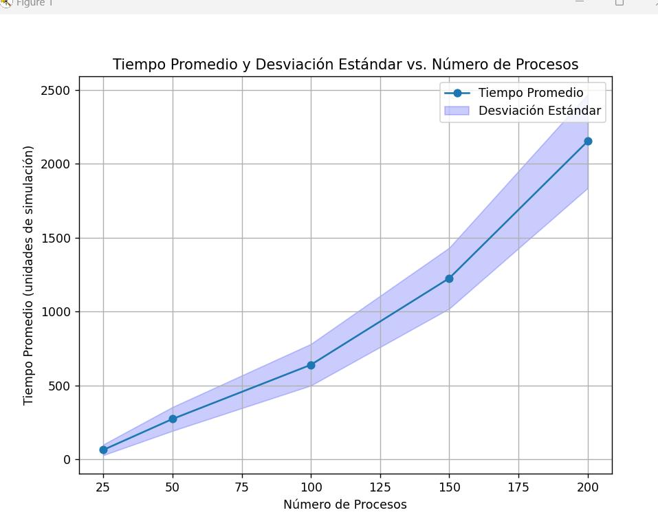

**200 memoria intervalo 10**

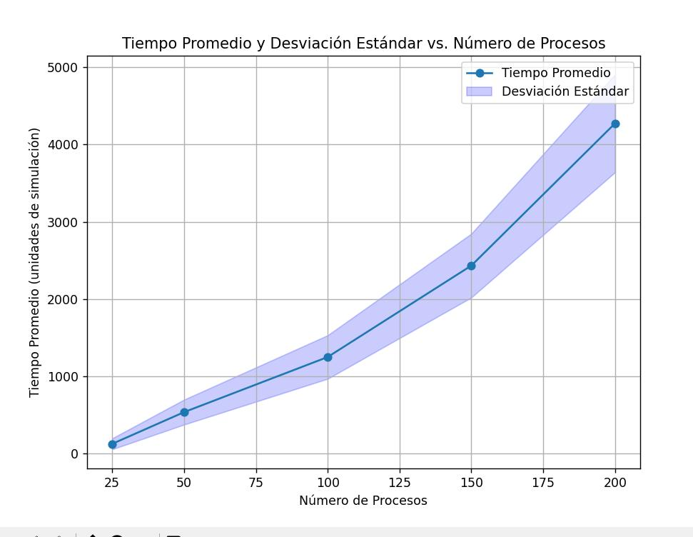

**6 instrucciones por unidad de tiempo intervalo 10**

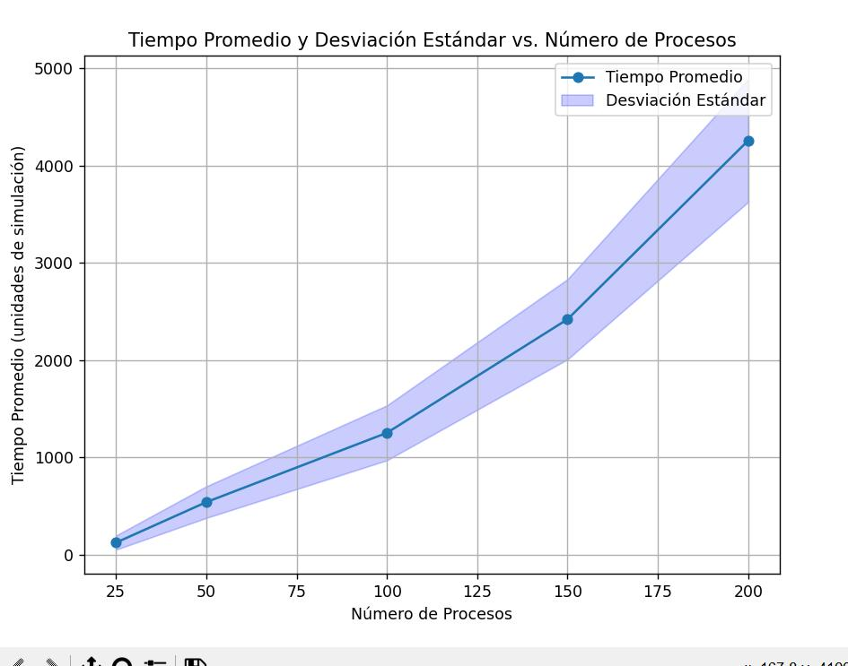

**2 hilos intervalo 10**

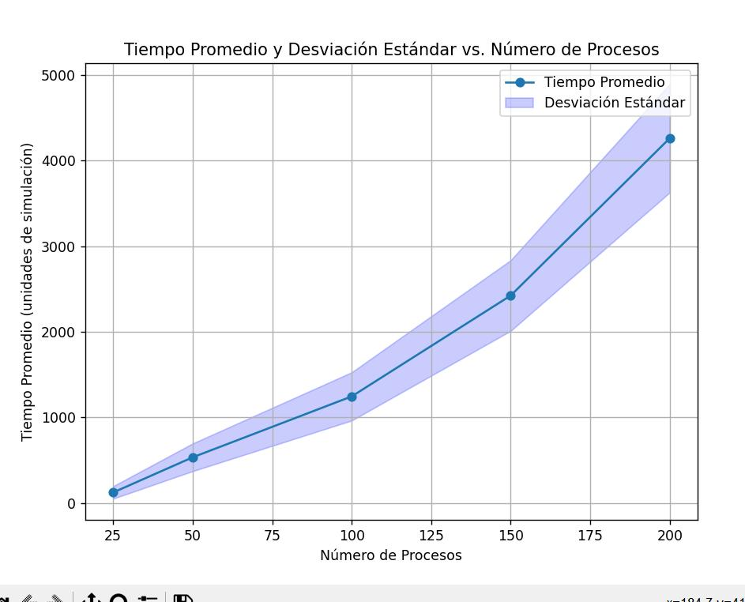
